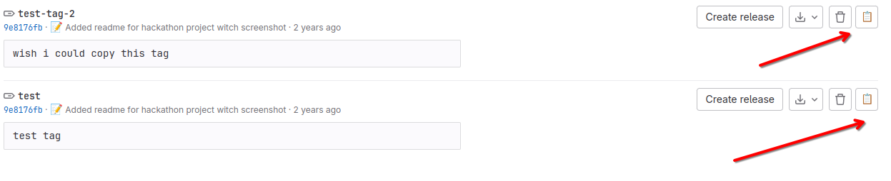

# Gitlab MR Copy

A cross-platform browser extension for Chrome and Firefox that improves copying tags and merge request titles from GitLab.

For more information see https://gitlab-mr-copy.koenhendriks.com/

## Features

Each feature can be toggled on or off in the extension popup.

### Add a copy button to GitLab MR pages to copy the title and URL

This is done in Rich text format with a single click (with Markdown fallback).

### Add a button to GitLab Tags pages to copy the tag name and URL

This is done in Rich text format with a single click (with Markdown fallback).

### Hides the 'Bypass button' from the MR page that shouldn't be used.

This is done by default and can be toggled on or off in the extension popup.

### Before

### After

## Installation

### Chrome Web Store

Go to the [Chrome Web Store page](https://chromewebstore.google.com/detail/gitlab-mr-title-copier/cjkopelbphphjbigokngkgchdkggfaak) and click Add to Chrome.

### Firefox Add-ons

*Coming soon* - Firefox Add-ons store submission pending.

### Manual

#### Chrome

1. Go to the [releases page](https://github.com/koenhendriks/Gitlab-MR-Copy/releases) and download `gitlab-mr-copy-chrome.zip`.
2. Go to the chrome extensions page in your browser (chrome://extensions/).
3. Enable developer mode in the top right corner.
4. Drag the downloaded file into the extensions page or click 'Load packed' and select the downloaded zip file.

#### Firefox

1. Go to the [releases page](https://github.com/koenhendriks/Gitlab-MR-Copy/releases) and download `gitlab-mr-copy-firefox.zip`.
2. Extract the downloaded zip file.
3. Go to about:debugging in your Firefox browser.
4. Click "This Firefox" on the left sidebar.
5. Click "Load Temporary Add-on" and select the manifest.json file from the extracted folder.

## License

See the [LICENSE](LICENSE) file for license rights and limitations (GNUv3).
